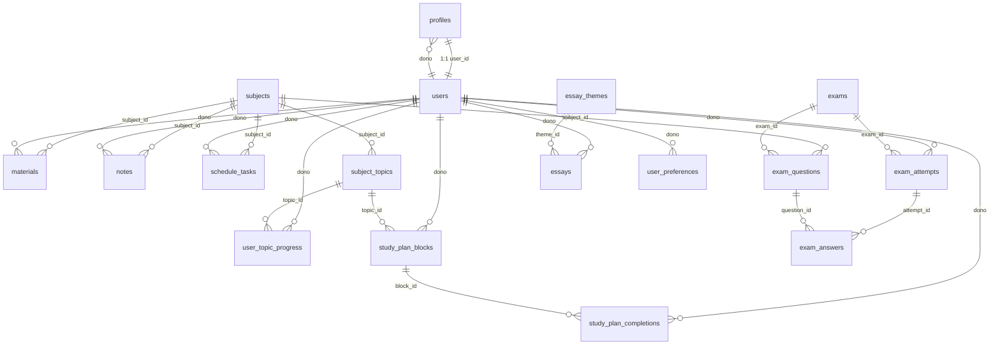

# Aprova+ ENEM 🎓✨

O **Aprova+ ENEM** é um portal de estudos completo, moderno e inteligente voltado à preparação de estudantes brasileiros para o Exame Nacional do Ensino Médio (ENEM). A plataforma oferece organização, cronogramas personalizados, gestão de materiais por matéria, simulados completos com estatísticas de desempenho e um inovador sistema de correção de redações automatizado via inteligência artificial (IA) baseado nos critérios oficiais de avaliação do ENEM.

---

## 🚀 Principais Funcionalidades

1. **Painel de Controle (Dashboard)**: Acompanhe sua sequência de estudos diária, progresso semanal geral, tempo planejado e conquistas de simulados em uma interface elegante e motivadora.
2. **Plano de Estudos Semanal**: Alterne entre os planos **Intensivo** (foco acelerado com 3 blocos diários) ou **Extensivo** (preparação contínua com 2 blocos diários). Os blocos são pré-gerados com tópicos curados do ENEM e totalmente editáveis.
3. **Cronograma Inteligente**: Agende tarefas, organize suas revisões diárias e marque atividades como concluídas para manter a consistência de estudos.
4. **Catálogo de Matérias**: 14 matérias oficiais do ENEM pré-carregadas. Em cada matéria, o aluno tem acesso a um checklist completo de tópicos para marcação de progresso, um bloco de anotações persistente e uma área para anexar materiais (PDFs, links de videoaulas, mapas mentais, etc.).
5. **Simulados com Gabarito**: Treine com simulados do Dia 1 (Linguagens e Humanas) e Dia 2 (Matemática e Natureza). Acompanhe o tempo decorrido, responda às questões e receba uma folha de resultados completa com o gabarito detalhado e justificativa pedagógica para cada questão.
6. **Redação com Correção por IA (Gemini)**: Escreva ou cole suas redações com base em temas históricos e contemporâneos do ENEM. Com apenas um clique, uma **Edge Function do Supabase** integrada ao modelo **Gemini 1.5 Flash (Lovable AI Gateway)** analisa a sua redação atribuindo notas de 0 a 200 para as 5 competências oficiais do ENEM, além de fornecer feedbacks construtivos e detalhados para cada competência e uma avaliação geral.

---

## 🛠️ Stack Tecnológica

O projeto foi construído utilizando as ferramentas mais modernas e eficientes do ecossistema de desenvolvimento web:

* **Frontend**:
  * [React 19](https://react.dev/) (Última versão, alta performance)
  * [TanStack Start](https://tanstack.com/start) & [TanStack Router](https://tanstack.com/router) (Roteamento robusto tipado e renderização otimizada)
  * [Tailwind CSS v4](https://tailwindcss.com/) (Estilização de ponta baseada em variáveis CSS nativas e cores em formato `oklch`)
  * [Lucide React](https://lucide.dev/) (Conjunto moderno de ícones vetoriais)
  * [Shadcn/ui](https://ui.shadcn.com/) (Componentes ricos em acessibilidade e estética premium)
  * [Recharts](https://recharts.org/) (Gráficos para análise de desempenho em simulados)
* **Backend & Infraestrutura**:
  * [Supabase](https://supabase.com/) (Autenticação JWT segura, Banco de Dados relacional PostgreSQL, e Storage para arquivos)
  * **Edge Functions**: Execução em borda (Deno runtime) para chamadas de IA e processamentos assíncronos seguros.
  * **AI Integration**: Lovable AI Gateway integrado ao **Gemini 1.5 Flash** para correções textuais em tempo real.

---

## 📊 Arquitetura de Banco de Dados

A arquitetura do banco de dados no Supabase foi modelada com integridade referencial estrita e políticas de segurança RLS (**Row Level Security**) avançadas para assegurar que cada estudante tenha acesso privado e seguro aos seus próprios dados.

Abaixo está o mapeamento conceitual das tabelas:



### Detalhamento das Tabelas Principais:

* `profiles`: Armazena metadados públicos do usuário logado (nome de exibição, avatar, e-mail).
* `subjects`: Catálogo estático das 14 disciplinas do ENEM (Português, Matemática, Biologia, etc.) com suas respectivas áreas do conhecimento e paleta de cores.
* `materials`: Links, PDFs e videoaulas adicionados pelo estudante para revisar uma determinada disciplina.
* `notes`: Bloco de anotações persistente em texto para cada matéria.
* `schedule_tasks`: Tarefas individuais agendadas no cronograma.
* `exams` & `exam_questions`: Cadastro de provas e questões de simulados com alternativas em formato JSONB e explicação pedagógica.
* `exam_attempts` & `exam_answers`: Histórico de tentativas do usuário, tempo gasto, pontuação e respostas marcadas em cada simulado.
* `essay_themes` & `essays`: Temas de redação curados do ENEM e os rascunhos ou redações completas dos alunos, contendo as notas (0 a 1000) e os detalhamentos da IA.
* `subject_topics` & `user_topic_progress`: Grade curricular completa do ENEM subdividida em tópicos específicos e o registro individual de quais tópicos o estudante já concluiu.
* `study_plan_blocks`: Divisão de blocos de estudo por dia da semana (`day_of_week` de 0 a 6) para o plano Intensivo ou Extensivo do usuário.
* `study_plan_completions`: Registro de conclusão dos blocos de estudo da semana.
* `user_preferences`: Armazena preferências globais do aluno (como o tipo de plano de estudo ativo).

---

## 💻 Como Rodar o Projeto Localmente

### Pré-requisitos
Certifique-se de ter o **Node.js** (v18 ou superior) ou **Bun** instalado na sua máquina.

### 1. Clonar e Acessar o Repositório
Como você já possui o diretório estruturado localmente:
```bash
# Navegue até o diretório do projeto no seu terminal
cd /Users/nerilde/.gemini/antigravity/scratch/portal-enem
```

### 2. Instalar as Dependências
Utilizando o instalador padrão do Node ou Bun:
```bash
npm install
# ou usando Bun
bun install
```

### 3. Configurar as Variáveis de Ambiente
O arquivo `.env` já vem pré-configurado com as chaves públicas e URLs de um banco de dados de demonstração no Supabase:
```env
VITE_SUPABASE_URL="https://wnmsbnyzzetpsmhmxrya.supabase.co"
VITE_SUPABASE_PUBLISHABLE_KEY="sb_publishable_B4ke6CzCxoihQVhziMAtQg_3RkvMso6"
```
Se preferir utilizar seu próprio projeto no Supabase, crie um arquivo `.env.local` na raiz do projeto e substitua as variáveis acima pelas suas chaves.

### 4. Executar o Servidor de Desenvolvimento
Inicie o servidor de desenvolvimento para visualizar a aplicação:
```bash
npm run dev
# ou usando Bun
bun run dev
```
O console exibirá o endereço local, geralmente [http://localhost:5173/](http://localhost:5173/). Abra-o no seu navegador para começar a explorar a plataforma!

---

## 🎨 Design System e Customização

O portal utiliza uma estética moderna e acolhedora de **Modo Escuro (Dark Mode)** e **Modo Claro (Light Mode)** baseada em variáveis dinâmicas usando a especificação `oklch` de cor. 

* **Cores Principais**:
  * `Primary`: Azul Indigo vibrante (`oklch(0.55 0.22 268)`) para botões principais e elementos ativos.
  * `Success`: Verde fresco (`oklch(0.7 0.18 155)`) para itens concluídos e acertos.
  * `Energy`: Laranja motivador (`oklch(0.74 0.18 50)`) para metas e conquistas.
* **Tipografia**:
  * Títulos: `Plus Jakarta Sans` para um ar moderno e tecnológico.
  * Textos: `Inter` para máxima legibilidade e conforto visual.

Todas as configurações de cores, transições e sombras elegantes estão consolidadas no arquivo [src/styles.css](file:///Users/nerilde/.gemini/antigravity/scratch/portal-enem/src/styles.css).

---

> [!TIP]
> **Recomendação**: Para facilitar o desenvolvimento e ter acesso imediato às ferramentas do Aprova+ ENEM no seu editor, **defina este diretório como o seu workspace ativo** executando `/workspace /Users/nerilde/.gemini/antigravity/scratch/portal-enem` no chat do assistente ou abrindo diretamente esta pasta no seu VS Code ou cursor.
